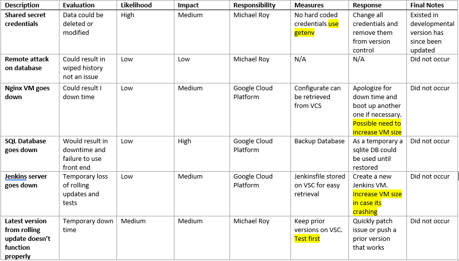
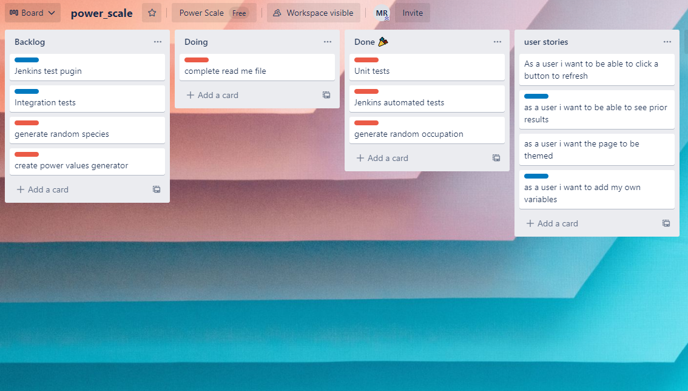
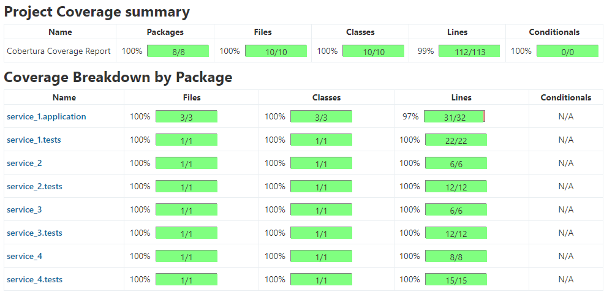

# Practical Project

## Contents
* [Introduction](#introduction) 
  * [Objective](#objective)
  * [Proposal](#proposal)
* [Architecture](#architecture)
  * [Risk Assessment](#risk-assessment)
  * [Kanban Board](#kanban-board)
  * [Test Analysis](#analysis-of-testing)
* [Infrastructure](#infrastructure)
  * [Jenkins](#jenkins)
  * [Entity Diagram](#entity-diagram)
  * [Docker Swarm](#interactions-diagram)
  * [The 4 Services](#the-4-services)
* [Development](#development)
  * [Front-End Design](#front-end)
  * [Unit Testing](#unit-testing)
* [Footer](#footer)

## Introduction
### Objective
The objective provided for this project is as follows:
> To create a service-orientated architecture for your application, this application must be composed of at least 4 services that work together.

The 4 containers must comprise of 1 front end service, 2 back end services and 1 other back end service that utalises data from the previus two back end services.

The following constraints were aso in place:
* Kanban Board: Asana or an equivalent Kanban Board
* Version Control: Git
* CI Server: Jenkins
* Configuration Management: Ansible
* Cloud server: GCP virtual machines
* Containerisation: Docker
* Orchestration Tool: Docker Swarm
* Reverse Proxy: NGINX

### Proposal
In order to furfil all of the requirements i decided to focus on the infastructure implementation of the CI/CD this allows for a fairly simple application. For the aplication i decide as to keep it simple i made a power scale utalising the following.
* Service 1 (front-end): displays the results of the following 3 services for the user to see, as well as a brief history of past results
* Service 2: returns a random occupation
* Service 3: returns a random species
* Service 4: returns a number based on the prior two services as a power level

## Architecture
### Risk Assessment
My detailed risk assessment can be seen below, outlining the risks that have potential to impact the project. A risk  assesment is an important tool to avoid issues wher epossible but also to be aware of solutions when risks arise.

Areas highlighted indidncate revisited risks

### Kanban Board
My project tracking board can be seen below. 

Trello was used over other similar providers as Trello is lightweight, free-to-use, and presents the board in a very visual way.

### Analysis of Testing
A test driven approach was taken to help find gaps in the application whilst it was being developed. As the app grew through to compleation tests were checked to ensure the app remained fully functioning 
utalising a jenkins plugin i was able to clearly see gaps in the testing and fill them  

As ypu can see this allows me to see any gaps within the testing leaving only a single line left untested resulting in 99% coverage

## Infrastructure
Continuous deployment is used throughout the project in order to allow for quick and smooth development. The approach taken allows deploying new versions of the application with limited down-time.

### Jenkins
Whenever new content is pushed to the `dev` branch, Github will send a webhook to Jenkins which tells it to run the following pipeline: