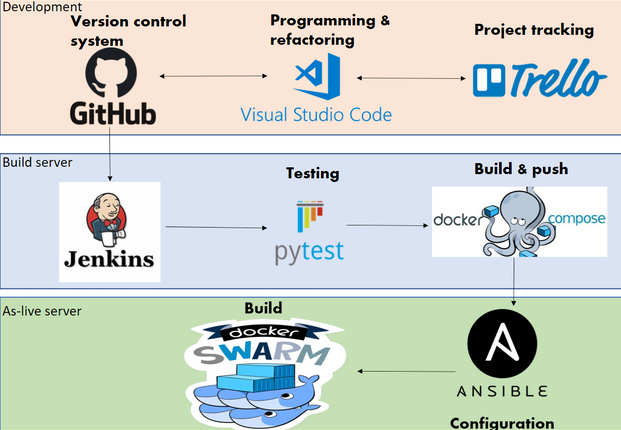
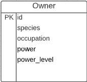
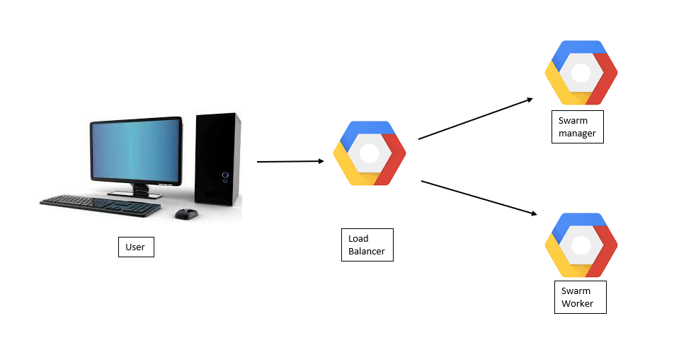
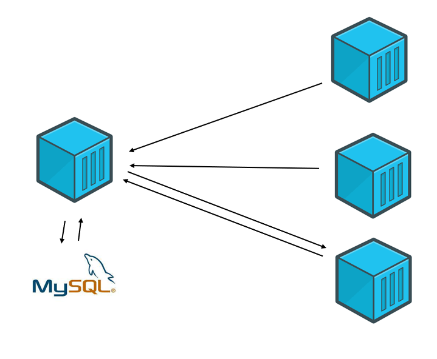
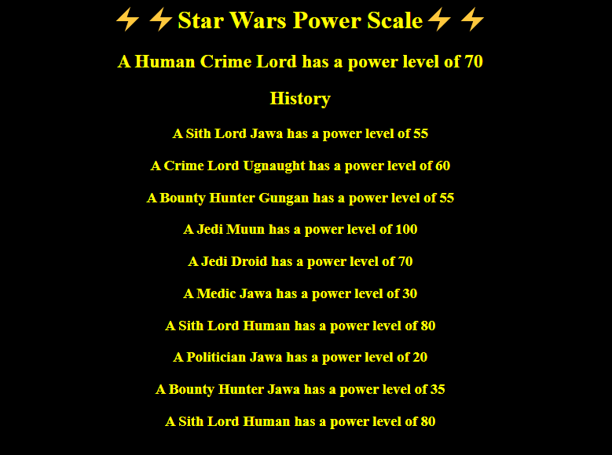
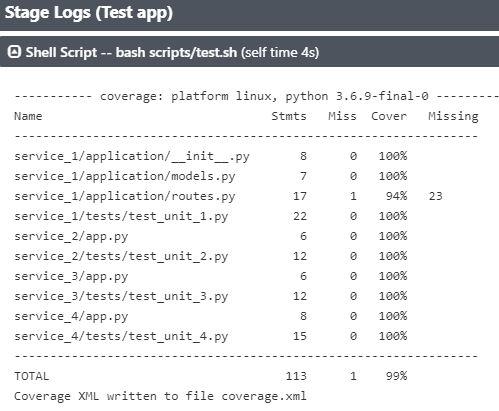

# Practical Project

## Contents
* [Introduction](#introduction) 
  * [Objective](#objective)
  * [Proposal](#proposal)
* [Architecture](#architecture)
  * [Risk Assessment](#risk-assessment)
  * [Kanban Board](#kanban-board)
  * [Test Analysis](#analysis-of-testing)
* [Infrastructure](#infrastructure)
  * [Jenkins](#jenkins)
  * [Entity Diagram](#entity-diagram)
  * [Docker Swarm](#interactions-diagram)
  * [The 4 Services](#the-4-services)
* [Development](#development)
  * [Front-End Design](#front-end)
  * [Unit Testing](#unit-testing)
* [Footer](#footer)

## Introduction
### Objective
The objective provided for this project is as follows:
> To create a service-orientated architecture for your application, this application must be composed of at least 4 services that work together.

The 4 containers must comprise of 1 front end service, 2 back end services and 1 other back end service that utalises data from the previus two back end services.

The following constraints were aso in place:
* Kanban Board: Asana or an equivalent Kanban Board
* Version Control: Git
* CI Server: Jenkins
* Configuration Management: Ansible
* Cloud server: GCP virtual machines
* Containerisation: Docker
* Orchestration Tool: Docker Swarm
* Reverse Proxy: NGINX

### Proposal
In order to furfil all of the requirements i decided to focus on the infastructure implementation of the CI/CD this allows for a fairly simple application. For the aplication i decide as to keep it simple i made a power scale utalising the following.
* Service 1 (front-end): displays the results of the following 3 services for the user to see, as well as a brief history of past results
* Service 2: returns a random occupation
* Service 3: returns a random species
* Service 4: returns a number based on the prior two services as a power level

## Architecture
### Risk Assessment
My detailed risk assessment can be seen below, outlining the risks that have potential to impact the project. A risk  assesment is an important tool to avoid issues wher epossible but also to be aware of solutions when risks arise.


Areas highlighted indidncate revisited risks

### Kanban Board
My project tracking board can be seen below. 


Trello was used over other similar providers as Trello is lightweight, free-to-use, and presents the board in a very visual way.

### Analysis of Testing
A test driven approach was taken to help find gaps in the application whilst it was being developed. As the app grew through to compleation tests were checked to ensure the app remained fully functioning 
utalising a jenkins plugin i was able to clearly see gaps in the testing and fill them  


As ypu can see this allows me to see any gaps within the testing leaving only a single line left untested resulting in 99% coverage

## Infrastructure
Continuous deployment is used throughout the project in order to allow for quick and smooth development. The approach taken allows deploying new versions of the application with limited down-time.

### Jenkins
Whenever new content is pushed Github will send a webhook to Jenkins which tells it to run the following pipeline:

#### **1.** Test: pytest  
> Unit tests are run as outlined [earlier](#analysis-of-testing). A coverage report is produced and can be viewed in the console logs. 

#### **2.** & **3.** Build & Push: docker-compose  
> Jenkins' credentials system is used to handle logging into DockerHub, and the new images are then pushed to the repository specified.

#### **4.** Configure: ansible 
> Ansible configures a few things:
> * Installing dependencies,
> * Setting up the swarm, and joining the swarm on all worker nodes,
> * Reloading NGINX with any changes to the nginx.conf file.

#### **5.** Deploy: docker swarm/stack 
> Jenkins copies the `docker-compose.yaml` file over to the manager node, SSH's onto it, and then runs `docker stack deploy`.


### Entity Diagram
While this project only makes use of one table in its database, it is still important to describe the structure of this table.



### Interactions Diagram
In the following diagram we are able to see the layout of the virtual machines as used in this project. This maps out where the information is taken from as a user connects to the NGINX machine on port 80.


### The 4 Services
The below diagram represents how the services interact with one another. 
the front-end sends GET requests to API-1 and API-2. It then sends their responses to API-3 as a POST request, and API-3 sends its data back in response. Now, finally, the front-end can send requests to the MySQL instance to INSERT the new entry, and SELECT the old entries in order to display a history to the user 


### Refactoring
 Though the approach laid out above hits the MVP, It has refactored it in several areas to improve performance.

#### Jenkins Plug-ins 
Using a plug in for jenkins as preveuslt mentioned i am=ble to have all results displayed cleary in graphs and charts 

## Development
### Front-End
When navigating to port 80 on the NGINX's IP, the steps will be taken as outlined in the previous 2 diagrams and the relevant information will be displayed in the format as shown below. This result is displayed using HTML


### Unit Testing
As the application was fairly basic the testing became minimal the only part that needed more detail was utalising mock tests as they wouldnt be abe to acess data fro other containers.
<br>
as you can see and was previusly mentioned only one line is left untested resulting in 99% coverage the methods for testing was as follows:

```sudo apt-get install python3-venv -y
python3 -m venv venv

source venv/bin/activate

pip3 install -r requirements.txt
python3 -m pytest --cov --cov-config=.coveragerc --cov-report term-missing --cov-report xml:coverage.xml --junitxml junit.xml

```
## Footer
### Future Improvements
* Add a button to refresh the page
* Possibly CRUD functionality
* Improve testing to include integration testing

### Author
Michael Roy
### Acknowledgements
* Ryan Wright

* Oliver Nichols